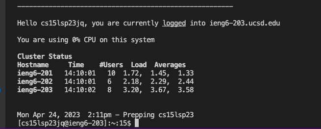

# Lab Report 1
## Step 1: Obtaining CSE15L Account Info
Use the following link to access your CSE15L account:
[Link](https://sdacs.ucsd.edu/~icc/index.php)
Once you find your account, reset the password by following the instructions 

## Step 2: VSCode
If not already installed, follow the instructions on the VSCode Website [Link](https://code.visualstudio.com/) to install VSCode.
After installation, you should be able to open the application and upon opening, see a window similar to the following:

## Step 3: Remotely Connecting
Since I am using a Mac, git does not need to be installed and instead can move on to opening the terminal in VSCode(View -> Terminal)
After opening the terminal, input the command(not including the $, and replacing zz with the letters of your account):
$ ssh cs15lsp23zz@ieng6.ucsd.edu
Once you are logged in, you should see something like this:

## Step 4: Testing Commands
After logging in, try running some commands such as "cd ~", "cd", "ls -lat", "ls -a" on the remote computer. Next, try to run the same commands on your computer. Running a command on the remote computer should look similar to this:
.png)

While running a command on your computer can look like this:

